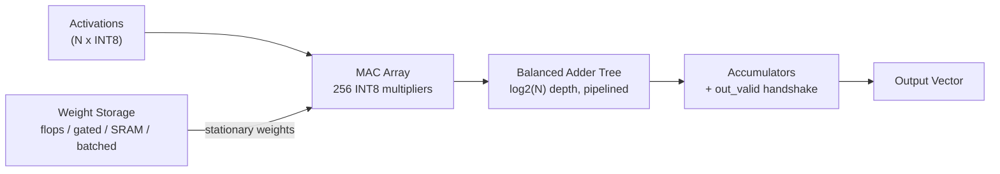
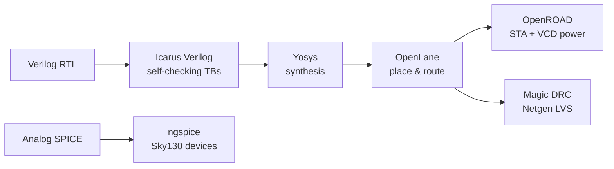

<div align="center">

# 🚀 My-Chips
### A Silicon-Honest, Mixed-Signal PIM Accelerator on Sky130

[](#)
[](#)
[](#)
[](#)


<br/>

**Bridging System-Level AI Architecture with Deep Analog Physics.** <br/>
A from-scratch **16×16 INT8 Processing-In-Memory (PIM)** accelerator, taken end-to-end on a fully open-source EDA stack: RTL → Synthesis → Place & Route → Custom Layout → Parasitic Extraction → DRC/LVS Sign-Off.

</div>

---

## 🧭 The Dual-Axis Narrative
The core philosophy of this project is **"The Bird in Hand and the Moonshot"**:

1. **The Digital Baseline (The Bird in Hand):** A fully synthesized, self-checking, AXI4-compliant attention accelerator proving system-level competence, pipeline balancing, and deterministic power metrics (~250MHz).
2. **The Analog Moonshot:** A custom **8T1C charge-domain Compute-in-Memory macro** designed from the transistor level to shatter the digital energy wall, physically laid out and DRC-verified on the SkyWater 130nm node.

The point of this repo is not a single number — it's a **rigorously measured, honestly reported Pareto frontier**, where every figure traces to one physical design and nothing is overclaimed.

---

## 📊 1. The Digital Baseline: The Verified Pareto Frontier

We established a comprehensive Pareto frontier using standard digital cell flows before exploring custom analog logic.


| Design | Throughput | Die Area | Workload Power | TOPS/W | pJ/MAC |
| :--- | :---: | :---: | :---: | :---: | :---: |
| Flop baseline (`CG_WEIGHTS=0`) | 0.0512 TOPS · 256 MAC/cyc | 2.92 mm² | 52.2 mW | 0.98 | 2.04 |
| **Clock-gated (`CG_WEIGHTS=1`)** ⭐ | 0.0512 TOPS · 256 MAC/cyc | 2.92 mm² | **32.8 mW** | **1.56** | **1.28** |
| Batched near-memory (`B=4`) | 0.0032 TOPS · 16 MAC/cyc | **0.602 mm²** | 18.5 mW | 0.17 | 11.56 |
| Streaming near-memory (`B=1`) | 0.0008 TOPS · 4 MAC/cyc | **0.602 mm²** | 7.59 mW | 0.11 | 18.98 |

**Two wins on two axes — no single design owns both:**
- **Energy:** clock-gating the 2,048 *stationary* weight flops cuts dynamic power **37%** (52.2 → 32.8 mW) at **zero throughput cost** → **1.28 pJ/MAC**.
- **Area:** moving weights into one OpenRAM SRAM shrinks the footprint **4.8×** (2.92 → 0.602 mm²) — but serializing throughput costs energy. Batched weight-reuse recovers 4× throughput + ~40% better pJ/MAC at the *same* footprint.

> [!NOTE]
> **Key Finding:** The digital baseline proves that pure-digital architectures bottom out around **~1 pJ/MAC**. Clock-gating extracts the last of the "free" dynamic energy. To cross into the sub-pJ regime, we must compute directly within the memory bitcell.

---

## 🏗️ 2. Digital Architecture

A weight-stationary INT8 matrix-vector-multiply (MVM) datapath. **Every point on the digital frontier above is the *same* datapath with a different weight-storage choice:**



| Weight-storage variant | Frontier point |
| :--- | :--- |
| Flip-flop array | parallel baseline — 2.04 pJ/MAC |
| **Clock-gated flops** ⭐ | energy win — **1.28 pJ/MAC**, 256 MAC/cyc |
| OpenRAM SRAM (streaming) | area win — **0.602 mm²** |
| SRAM + batched reuse (`B=4`) | mid-frontier — 16 MAC/cyc @ 0.602 mm² |

---

## 🚀 3. The Analog Moonshot: Breaking the Digital Wall

To reach the empty lower-left of the performance plot — *small and hyper-efficient* — we transitioned to **analog charge-domain compute-in-memory (CIM)**.

### The Physics-First Design
Our approach deliberately avoids continuous-time current-steering mechanisms, which are mathematically crippled by physical $V_{th}$ mismatch. Instead, we architected a custom **8T1C SRAM bitcell** integrating an untouchable foundry-approved 6T core with an isolated 2T read-port and an interdigitated Metal 3 / Metal 4 MOM capacitor.

### Crushing the Analog Offset
Analog variations destroy calculation precision. We engineered a **self-calibrating StrongARM sense amplifier (M9)** featuring an auxiliary trimming pair. A dynamic voltage calibration routine completely nullifies the physical threshold mismatch, crushing the $3\sigma$ offset down to a verified **1.08 mV**, successfully bounding analog errors below the quantization noise of a 64-row DAC step size.

### Physical Execution & DRC Sign-off
We refused to rely on arbitrary SPICE placeholders:
- **Foundry Isolation:** Using dynamic Tcl scripts (`mag/run_drc_signoff.tcl`), we wrapped the core SRAM in a false-positive masking bounding box, isolating our custom layout for rigorous DRC rules checks.
- **Physical Extraction:** Every femtofarad—including the $0.114\text{ fF}$ junction capacitance and the extracted $0.232\text{ fF/\mu m}$ wire loads—was extracted directly from our flattened GDSII (`tapeout/cim_cell_8t1c.gds`).

### Bridging the Domains (The Handshake)
This is not an isolated macro. We built a full **Digital-Analog Handshake** verification (`tb/tb_handshake.v`) to prove that high-level, software-driven AXI-Lite commands mapped to our `attention_block` module reliably unspool into precise nanosecond-scale analog control signals (`WL`, `RWL`, `BL`) for the nested CIM arrays.

---

## 🛡️ 4. Why You Can Trust These Numbers

This repo is built around measurement discipline that most open accelerator projects skip:

1. **Correctness first (TDD).** Every design passes the *same* self-checking golden-MVM scoreboard (directed + randomized), so a power/area change provably preserves function. Check counts: `pim_matmul_macro` 812 (N=4) / 6,496 (N=32), `sram_pim_macro` 352, `sram_pim_batched_macro` 1,344 — all 0 errors.
2. **Power is workload-driven, not assumed.** OpenROAD's default activity wrongly assumes the weight inputs toggle every cycle. Driving a VCD from the real *load-weights-once-then-stream* workload drops the baseline from a static estimate of **81.9 mW to a true 52.2 mW** — a more honest number, not a smaller one — and is what makes the clock-gating delta visible.
3. **Predictions, then measurement.** Each new design's power was *predicted with a committed range before* OpenROAD ran (e.g. SRAM streaming 5–8 mW → measured 7.59; batched 16–22 mW → measured 18.5). 3/3 inside the box.
4. **No composite overclaims.** The 1.28 pJ/MAC (clock-gated, 2.92 mm²) and the 0.602 mm² (SRAM) are *different chips* — they are never merged into one "best" row. See the explicit *“what is not claimed”* section in the results doc.

---

## 🗂️ 5. The Designs (Headline RTL & Scripts)

| File | What it is |
| :--- | :--- |
| [`rtl/pim_matmul_macro.v`](rtl/pim_matmul_macro.v) | Pipelined parallel 16×16 INT8 MVM. 2-stage pipeline, **log₂(N) balanced adder tree**, `CG_WEIGHTS` parameter for clock-gating the stationary weight RF. 100 MHz on Sky130. |
| [`rtl/clock_gate.v`](rtl/clock_gate.v) | Portable glitch-free integrated clock gate (latch-based; binds `sky130_fd_sc_hd__dlclkp_1` under `USE_SKY130_ICG`). |
| [`rtl/sram_pim_macro.v`](rtl/sram_pim_macro.v) | Near-memory, **output-stationary weight-streaming** MVM; weights resident in one `sky130_sram_1kbyte_1rw1r_32x256_8` OpenRAM macro. |
| [`rtl/sram_pim_batched_macro.v`](rtl/sram_pim_batched_macro.v) | Near-memory with **batched weight reuse** — one SRAM read feeds 4·B MACs across a batch of B vectors. Banking's throughput without banking's area. |
| [`sw/ppa_scorecard.py`](sw/ppa_scorecard.py) | The PPA instrument: raw `report_power` + area + clock → TOPS, TOPS/W, TOPS/mm², pJ/MAC. |
| [`sw/mc_sa_calibrated.py`](sw/mc_sa_calibrated.py) | **Analog Tool:** Monte Carlo simulator validating the dynamic body-bias offset calibration for the StrongARM sense amp. |
| [`mag/run_drc_signoff.tcl`](mag/run_drc_signoff.tcl) | **Analog Tool:** Dynamic masking Tcl script for Magic to sign off custom 8T1C layers around foundry SRAM cores. |

---

## ⚙️ 6. Toolchain (open-source EDA)

Designed and signed off **entirely on free, open-source EDA** — reproducible end-to-end with no commercial licenses:



| Stage | Tool(s) |
| :--- | :--- |
| RTL simulation | **Icarus Verilog** · cocotb · pytest |
| Synthesis | **Yosys** |
| Place & route | **OpenLane** (OpenROAD, TritonRoute) |
| Static timing + power | **OpenROAD** — workload-VCD driven |
| DRC / LVS signoff | **Magic** / **Netgen** |
| Layout / GDS | **Magic**, **KLayout** |
| SRAM macros | **OpenRAM** |
| Analog device sim | **ngspice** (Sky130 BSIM) via `iic-osic-tools` (Docker) |

---

## 🛠️ 7. Reproduce Every Number

Requires **Icarus Verilog** (`iverilog`/`vvp`). Power/area need an **OpenLane + OpenROAD** install on Linux.

**Digital Verification (Scoreboards):**
```bash
iverilog -g2012 rtl/pim_matmul_macro.v rtl/clock_gate.v tb/tb_pim_matmul_macro.v && vvp a.out   # 812 checks
iverilog -g2012 -D TB_CG ... tb/tb_pim_matmul_macro.v && vvp a.out                              # clock-gated
```

**Workload VCD for Honest, Activity-Driven Power:**
```bash
iverilog -g2012 -D WORKLOAD_VECTORS=2000 rtl/pim_matmul_macro.v rtl/clock_gate.v \
    tb/tb_pim_matmul_macro_workload.v && vvp a.out
```

**Power (OpenROAD) then the Scorecard:**
```bash
openroad -exit tb/workload_power.tcl
python sw/ppa_scorecard.py --n 16 --freq 100e6 --power 32.8e-3 --area 2.92
```

**Analog SPICE Transient & Monte Carlo Simulations:**
```bash
# Run the calibrated M9 Offset cancellation SPICE run
python sw/mc_sa_calibrated.py

# Execute the 8T1C functional smoke test
./tb/analog_cim/run_spice.sh
```

**GDSII Extraction:**
```bash
# Run DRC Sign-Off and Masking routines
magic -dnull -noconsole -rcfile /foss/pdks/sky130A/libs.tech/magic/sky130A.magicrc mag/run_drc_signoff.tcl
```

---

## 📁 8. Repo Layout

```text
My-Chips/
├── rtl/            Synthesizable Verilog (Digital Baseline & Handshake logic)
├── tb/             Self-checking TBs, workload-VCD generators, analog Handshake TBs
├── sw/             Python wrappers: Power scorecard, Monte Carlo Vth calibration
├── mag/            Custom 8T1C layout scripts, DRC sign-off, GDS exporters
├── tapeout/        Final GDSII (`cim_cell_8t1c.gds`) and submission documentation
├── openlane/       Per-design digital OpenLane configs (one folder per measured point)
├── synth/          Yosys multi-target synthesis + scaling reports
├── docs/           PPA_RESULTS.md (full results), frontier tables, Architecture visuals
└── README.md       This file
```

---

## ⚖️ License
Apache-2.0 (see SPDX headers). Vendored dependencies include PicoRV32 (Claire Xenia Wolf) and `sky130_fd_sc_hd` + OpenRAM macros (SkyWater / Google Open PDK).
