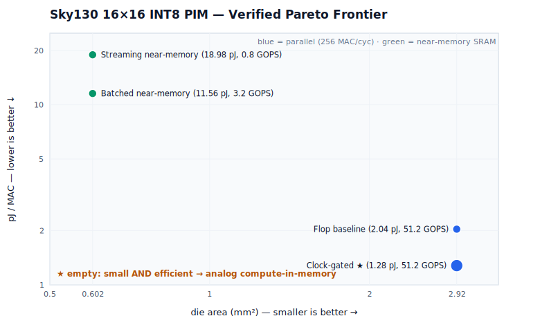

# My-Chips — A Silicon-Honest PIM Accelerator on Sky130

A from-scratch **16×16 INT8 Processing-In-Memory (PIM) matrix-vector-multiply
accelerator**, taken end-to-end on the fully open stack: **RTL → self-checking
verification → Yosys synthesis → OpenLane place-and-route → workload-driven power
measurement**, on the open-source **SkyWater 130 nm** PDK and **OpenRAM** macros.

The point of this repo is not a single number — it's a **rigorously measured,
honestly reported Pareto frontier** of four real designs, where every figure
traces to one physical design and nothing is overclaimed.

---

## TL;DR — the verified Pareto frontier



| Design | Throughput | Die area | Workload power | TOPS/W | pJ/MAC |
| :--- | :---: | :---: | :---: | :---: | :---: |
| Flop baseline (`CG_WEIGHTS=0`) | 0.0512 TOPS · 256 MAC/cyc | 2.92 mm² | 52.2 mW | 0.98 | 2.04 |
| **Clock-gated (`CG_WEIGHTS=1`)** ⭐ | 0.0512 TOPS · 256 MAC/cyc | 2.92 mm² | **32.8 mW** | **1.56** | **1.28** |
| Batched near-memory (`B=4`) | 0.0032 TOPS · 16 MAC/cyc | **0.602 mm²** | 18.5 mW | 0.17 | 11.56 |
| Streaming near-memory (`B=1`) | 0.0008 TOPS · 4 MAC/cyc | **0.602 mm²** | 7.59 mW | 0.11 | 18.98 |

**Two wins on two axes — no single design owns both:**
- **Energy:** clock-gating the 2,048 *stationary* weight flops cuts dynamic power
  **37%** (52.2 → 32.8 mW) at **zero throughput cost** → **1.28 pJ/MAC**.
- **Area:** moving weights into one OpenRAM SRAM shrinks the footprint **4.8×**
  (2.92 → 0.602 mm²) — but serializing throughput costs energy, so near-memory is
  an **area/leakage play, not an energy-per-MAC play**. (Batched weight-reuse
  recovers 4× throughput + ~40% better pJ/MAC at the *same* footprint.)

The empty lower-left of the plot — *small **and** efficient* — is the unsolved
corner that digital can't reach. That's the **analog compute-in-memory** frontier
this project is heading toward next.

➡️ Full methodology, power breakdowns, and disclaimers: **[docs/PPA_RESULTS.md](docs/PPA_RESULTS.md)**

---

## Why you can trust these numbers

This repo is built around measurement discipline that most open accelerator
projects skip:

1. **Correctness first (TDD).** Every design passes the *same* self-checking
   golden-MVM scoreboard (directed + randomized), so a power/area change provably
   preserves function. Check counts: `pim_matmul_macro` 812 (N=4) / 6,496 (N=32),
   `sram_pim_macro` 352, `sram_pim_batched_macro` 1,344 — all 0 errors.
2. **Power is workload-driven, not assumed.** OpenROAD's default activity wrongly
   assumes the weight inputs toggle every cycle. Driving a VCD from the real
   *load-weights-once-then-stream* workload drops the baseline from a static
   estimate of **81.9 mW to a true 52.2 mW** — a more honest number, not a smaller
   one — and is what makes the clock-gating delta visible.
3. **Predictions, then measurement.** Each new design's power was *predicted with a
   committed range before* OpenROAD ran (e.g. SRAM streaming 5–8 mW → measured 7.59;
   batched 16–22 mW → measured 18.5). 3/3 inside the box.
4. **No composite overclaims.** The 1.28 pJ/MAC (clock-gated, 2.92 mm²) and the
   0.602 mm² (SRAM) are *different chips* — they are never merged into one "best"
   row. See the explicit *“what is not claimed”* section in the results doc.

---

## The designs (headline RTL)

| File | What it is |
| :--- | :--- |
| [`rtl/pim_matmul_macro.v`](rtl/pim_matmul_macro.v) | Pipelined parallel 16×16 INT8 MVM. 2-stage pipeline, **log₂(N) balanced adder tree** (`pim_adder_tree`), `CG_WEIGHTS` parameter for clock-gating the stationary weight RF. 100 MHz on Sky130. |
| [`rtl/clock_gate.v`](rtl/clock_gate.v) | Portable glitch-free integrated clock gate (latch-based; binds `sky130_fd_sc_hd__dlclkp_1` under `USE_SKY130_ICG`). |
| [`rtl/sram_pim_macro.v`](rtl/sram_pim_macro.v) | Near-memory, **output-stationary weight-streaming** MVM; weights resident in one `sky130_sram_1kbyte_1rw1r_32x256_8` OpenRAM macro. |
| [`rtl/sram_pim_batched_macro.v`](rtl/sram_pim_batched_macro.v) | Near-memory with **batched weight reuse** — one SRAM read feeds 4·B MACs across a batch of B vectors. Banking's throughput without banking's area. |
| [`sw/ppa_scorecard.py`](sw/ppa_scorecard.py) | The PPA instrument: raw `report_power` + area + clock → TOPS, TOPS/W, TOPS/mm², pJ/MAC (TDD'd; `--macs-per-cycle` for serialized designs). |
| [`sw/plot_frontier.py`](sw/plot_frontier.py) | Regenerates `docs/frontier.svg` from `docs/frontier.csv` (zero deps). |

This sits on a larger from-scratch RTL library also in `rtl/`: an **MXFP4/8
microscaling attention core** (`mx_*`), a **CGRA reconfigurable fabric** with a Go
compiler (`cgra_*`, `sw/compiler/`), a systolic array, PIM crossbar, and a
PicoRV32 SoC.

---

## Reproduce every number

Requires **Icarus Verilog** (`iverilog`/`vvp`). Power/area need an **OpenLane +
OpenROAD** install on Linux (the flow's GDS/PDN steps fail on Windows file mounts).

```bash
# ---- Functional verification (golden scoreboards) ----
iverilog -g2012 rtl/pim_matmul_macro.v rtl/clock_gate.v tb/tb_pim_matmul_macro.v && vvp a.out   # 812 checks
iverilog -g2012 -D TB_CG ... tb/tb_pim_matmul_macro.v && vvp a.out                              # clock-gated
iverilog -g2012 -D TB_N=32 ... tb/tb_pim_matmul_macro.v && vvp a.out                            # N=32 scaling (6496)
iverilog -g2012 rtl/sram_pim_macro.v tb/sky130_sram_1kbyte_1rw1r_32x256_8.v tb/tb_sram_pim_macro.v && vvp a.out          # 352
iverilog -g2012 rtl/sram_pim_batched_macro.v tb/sky130_sram_1kbyte_1rw1r_32x256_8.v tb/tb_sram_pim_batched_macro.v && vvp a.out  # 1344

# ---- Workload VCD for honest, activity-driven power ----
iverilog -g2012 -D WORKLOAD_VECTORS=2000 rtl/pim_matmul_macro.v rtl/clock_gate.v \
    tb/tb_pim_matmul_macro_workload.v && vvp a.out        # (+ -D TB_CG for the gated VCD)

# ---- Power (OpenROAD) then the scorecard ----
openroad -exit tb/workload_power.tcl                      # edit run paths inside
python sw/ppa_scorecard.py --n 16 --freq 100e6 --power 32.8e-3 --area 2.92

# ---- Instruments ----
python -m pytest sw/test_ppa_scorecard.py                 # scorecard unit tests
python sw/plot_frontier.py                                # regenerate docs/frontier.svg
```

OpenLane configs for every measured point live under `openlane/` (baseline,
`_cg`, `_n32`, `_n32_cg`, `sram_pim_macro`, `sram_pim_batched_macro`), each with
its own README for run + measurement.

---

## Repo layout

```
rtl/        synthesizable Verilog (PIM designs + broader accelerator library)
tb/         self-checking testbenches, workload-VCD generators, power .tcl
sw/         ppa_scorecard.py, plot_frontier.py, CGRA compiler, sim runners
openlane/   per-design OpenLane configs (one folder per measured point)
synth/      Yosys multi-target synthesis + scaling reports
docs/       PPA_RESULTS.md (full results), frontier.csv (data), frontier.svg (figure)
sim/        Icarus regression runner
```

---

## Roadmap — the next frontier

The frontier above proves digital PIM bottoms out around **~1 pJ/MAC** on Sky130:
clock-gating extracts the last of the easy energy, near-memory only buys area. The
empty lower-left corner — *small **and** efficient* — needs **analog
compute-in-memory** (multiply as charge/current inside the bitcell), the one axis
the memory wall can't be engineered around digitally. That work is starting in
[`sw/simulate_analog_cim.py`](sw/simulate_analog_cim.py), with the digital frontier
here serving as the honest baseline it must beat.

---

## License

Apache-2.0 (see SPDX headers). Vendored: PicoRV32 (Claire Xenia Wolf),
`sky130_fd_sc_hd` + OpenRAM macros (SkyWater / Google open PDK).
